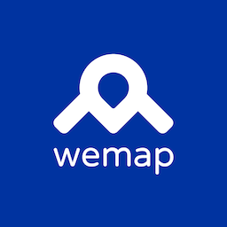

# Wemap SDK Sample apps iOS



## Requirements

* Xcode 14+
* Swift 5+
* Gems - using Bundler and Gemfile or manually
  * cocoapods
  * cocoapods-s3-download

## Installation

* download repository

* install necessary gems using Bundler and Gemfile or manually

  ``` shell
  bundle install
  ```

* run in console in project folder

  ``` shell
  AWS_ACCESS_KEY_ID=*** \
  AWS_SECRET_ACCESS_KEY=*** \
  AWS_REGION=*** \
  bundle exec pod install --repo-update
  ```

* open `WemapExamples.xcworkspace`

* modify `mapID`, `token` and optionally `polestarApiKey`, `vpsEndpoint` [here in Constants](./Examples/Sources/Constants.swift)

* build and run desired example app scheme

## Examples

* MapExample

  * Levels - shows how to set custom indoor location provider and switch between levels
  * Points of interests - shows how to perform selection of POIs on the map
  * Navigation - shows how to start navigation to some user-created annotation

* Map+PositioningExample. Shows how to connect different Location Sources to `WemapMapSDK`.

* PosExample. Shows how to work VPS Location source without `WemapMapSDK`. For example if you want to connect `WemapPositioningSDK/VPSARKit` to your own map.
